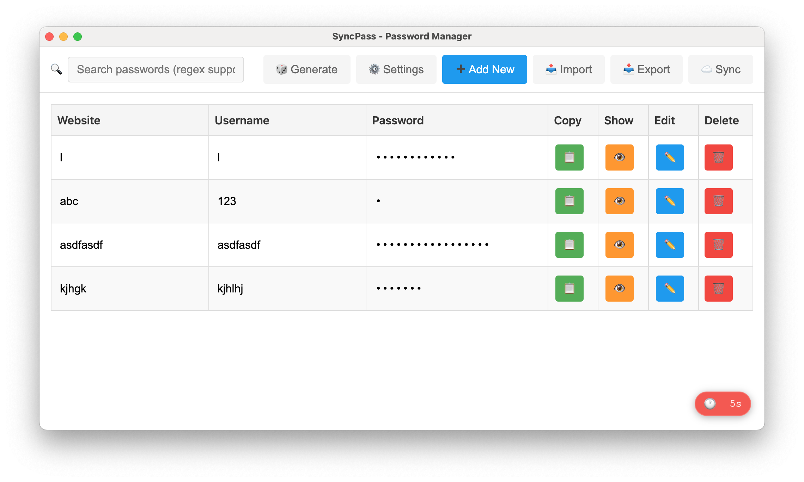

# A Self Hosted Syncing Password Manager for S3

I have been looking for a password manager similar to Enpass that is open source, works with s3 for self hosting and syncing and has encryption. This is my first version of an electron app with the following features.

- Searchable account names (can use regex to find accounts)
- Simple scrollable UI with hidden and copyable passwords
- Export and import functionality, as well as S3 sync
- AES encryption of passwords (further testing required here to make sure claude code didn't add any surprises)
- Password generator screen (need to add actual common word functionality)
- Automatic sleep screen that closes window after no longer using it.




THis requires node to be installed. Also, because this is an electron app the release is too big to host here on github. If you want to try it out and use the app simply download and run. 


```{bash}

> npm install
...
> npm build

```


### N.B.
Currently a almost all of this app has been vibe coded with claude code and it may not be ready yet for everyday use. I will update this readme after I have checked through the code and added more testing. 2025/10/08
